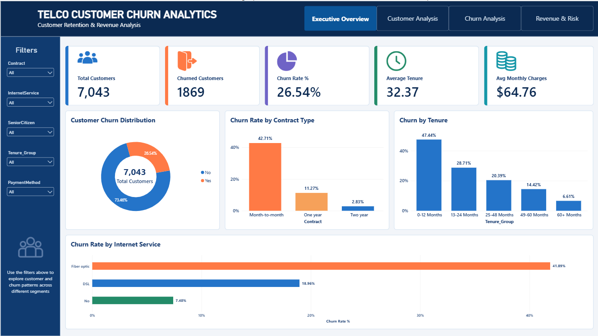
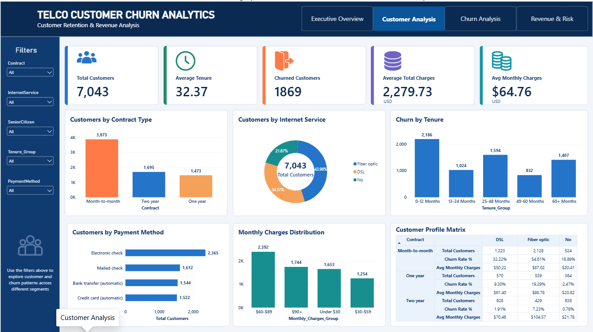
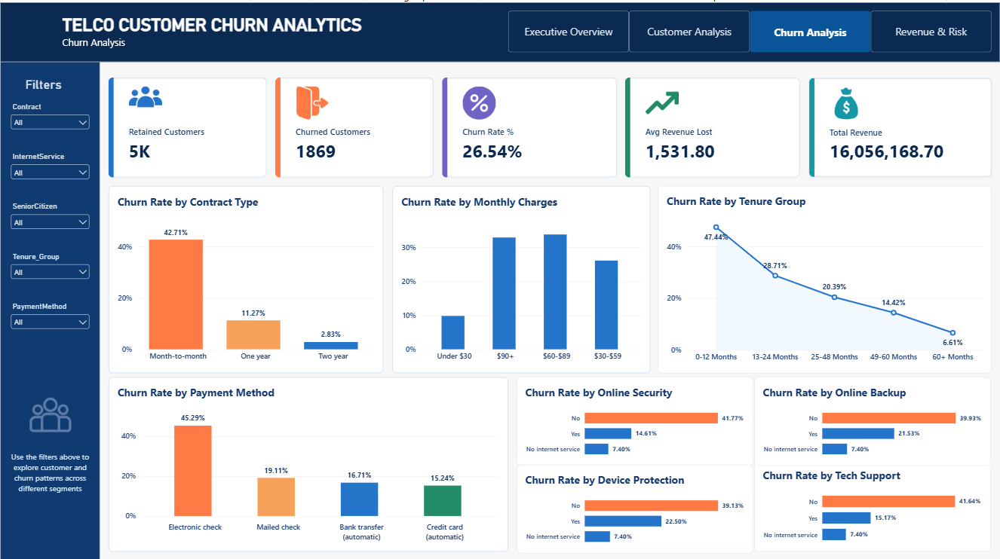
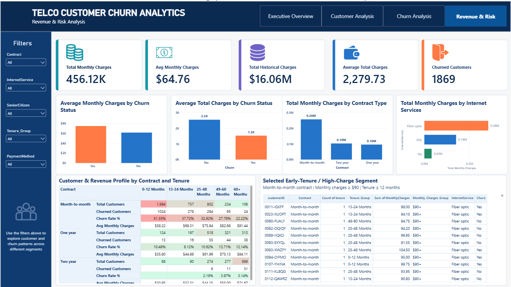

# 📊 Telco Customer Churn Analytics

> **End-to-end customer churn analysis using Excel, MySQL, Python, Pandas, and Power BI**


---

## 📌 Project Overview

Customer churn is an important business problem for subscription-based companies because losing existing customers can affect recurring revenue and long-term customer relationships.

This project analyzes a telecommunications customer dataset containing **7,043 customer records** to understand customer characteristics, service usage, contract patterns, payment methods, monthly charges, tenure, and churn behavior.

The project follows a complete data analytics workflow:

**Excel → MySQL → Python → Power BI**

The objective is not only to calculate the overall churn rate, but also to identify **customer segments and characteristics associated with higher churn** and present the findings through an interactive business dashboard.

---

## 🎯 Business Objective

The main objective of this project is to answer the following business questions:

* How many customers are currently represented in the dataset?
* How many customers have churned?
* What is the overall churn rate?
* Which contract types are associated with higher churn?
* How does churn vary across customer tenure groups?
* Which payment methods are associated with higher churn?
* How does churn vary across monthly charge groups?
* How does churn differ by internet service?
* How do customer services such as Online Security and Tech Support relate to churn?
* What are the financial characteristics of churned and retained customers?
* Which selected customer segments may deserve further business attention?

---

# 🛠️ Tools & Technologies

| Tool                 | Purpose                                       |
| -------------------- | --------------------------------------------- |
| **Microsoft Excel**  | Data cleaning, validation, calculated columns |
| **MySQL**            | Data storage, SQL analysis, segmentation      |
| **Python**           | Data validation, EDA, insight generation      |
| **Pandas**           | Data manipulation and analysis                |
| **NumPy**            | Numerical operations                          |
| **Matplotlib**       | Data visualization                            |
| **Seaborn**          | Statistical visualization                     |
| **Power BI**         | Interactive dashboard and business reporting  |
| **DAX**              | Power BI measures and calculations            |
| **Jupyter Notebook** | Python analysis environment                   |
| **GitHub**           | Version control and project documentation     |

---

# 📂 Dataset

The project uses the IBM Telco Customer Churn dataset.

### Dataset Size

* **Customers:** 7,043
* **Original Features:** 21
* **Final Analytical Columns:** 25

### Original Customer Attributes

The dataset contains information related to:

* Customer demographics
* Partner and dependent status
* Customer tenure
* Phone services
* Internet services
* Online security
* Online backup
* Device protection
* Technical support
* Streaming services
* Contract type
* Paperless billing
* Payment method
* Monthly charges
* Total charges
* Churn status

### Analytical Columns Added

The project additionally created:

* `Tenure_Group`
* `Monthly_Charges_Group`
* `Senior_Citizen_Status`
* `Churn_Flag`

---

# 🔄 Project Workflow

```text
                    TELCO CUSTOMER CHURN ANALYTICS
                              │
                              ▼
                     Raw Customer Dataset
                              │
                              ▼
                    ┌─────────────────┐
                    │      Excel      │
                    │ Data Cleaning   │
                    │ & Validation    │
                    └────────┬────────┘
                             │
                             ▼
                    ┌─────────────────┐
                    │     MySQL       │
                    │ SQL Analysis    │
                    │ Segmentation    │
                    └────────┬────────┘
                             │
                             ▼
                    ┌─────────────────┐
                    │     Python      │
                    │ EDA & Insights  │
                    └────────┬────────┘
                             │
                             ▼
                    ┌─────────────────┐
                    │    Power BI     │
                    │   Dashboard     │
                    └────────┬────────┘
                             │
                             ▼
                    Business Insights
```

---

# 🧹 1. Data Cleaning & Preparation — Excel

The first stage of the project focused on preparing the raw dataset for analysis.

### Cleaning tasks included:

* Checking duplicate records
* Checking duplicate customer IDs
* Reviewing missing values
* Converting numerical fields to appropriate data types
* Handling blank `TotalCharges` values
* Validating customer records
* Creating analytical grouping columns

### Additional analytical columns

#### Tenure Group

Customers were grouped into:

* 0–12 Months
* 13–24 Months
* 25–48 Months
* 49–60 Months
* 60+ Months

#### Monthly Charges Group

Customers were grouped into:

* Under $30
* $30–$59
* $60–$89
* $90+

#### Senior Citizen Status

The binary `SeniorCitizen` field was converted into a readable category:

* Senior Citizen
* Non-Senior Citizen

#### Churn Flag

The categorical churn field was converted into:

* `1` = Churned
* `0` = Retained

---

# 🗄️ 2. SQL Analysis — MySQL

The cleaned dataset was imported into MySQL for structured analysis.

### Database

```sql
telco_churn_analytics
```

### Main Table

```text
telco_churn
```

### SQL Analysis Modules

```text
sql/
├── 01_database_setup.sql
├── 02_basic_analysis.sql
├── 03_customer_analysis.sql
├── 04_churn_analysis.sql
└── 05_revenue_analysis.sql
```

---

## SQL Analysis Covered

### Basic Customer Analysis

* Total customers
* Churned customers
* Retained customers
* Churn rate
* Average tenure
* Minimum and maximum tenure
* Average monthly charges
* Total monthly charges
* Average total charges
* Total historical charges

### Customer Segmentation

Customer behavior was analyzed across:

* Gender
* Senior citizen status
* Partner status
* Dependents
* Contract
* Internet service
* Payment method
* Phone service
* Multiple lines
* Online security
* Online backup
* Device protection
* Technical support
* Streaming services
* Paperless billing

### Churn Analysis

Churn was analyzed across:

* Contract type
* Tenure group
* Payment method
* Internet service
* Monthly charge group
* Senior citizen status
* Customer services
* Contract + Internet Service
* Contract + Payment Method
* Tenure + Contract

### Revenue Analysis

Financial characteristics were analyzed using:

* Monthly charges
* Total historical charges
* Average monthly charges
* Average historical charges
* Contract-level charges
* Internet-service-level charges
* Payment-method-level charges
* Churned vs retained customer charges

> **Note:** Monthly charges associated with churned customers are treated as the customers' current-record monthly charges, not verified future revenue loss. Total charges represent historical/recorded charges.

---

# 🐍 3. Python Analysis

Python was used to validate the cleaned dataset, perform exploratory data analysis, and generate business insights.

### Main libraries

```python
import pandas as pd
import numpy as np
import matplotlib.pyplot as plt
import seaborn as sns
```

### Python notebooks

```text
notebooks/
├── 01_data_validation.ipynb
├── 02_eda.ipynb
└── 03_insights.ipynb
```

---

## 01 — Data Validation

The validation notebook checks:

* Dataset shape
* Column structure
* Data types
* Missing values
* Duplicate rows
* Duplicate customer IDs
* Unique customers
* Numerical statistics
* Categorical distributions

Expected cleaned dataset:

```text
Rows:       7,043
Columns:    25
```

---

## 02 — Exploratory Data Analysis

EDA was performed to understand customer and churn patterns.

### Visual analysis included:

* Overall churn distribution
* Churn rate by contract
* Churn rate by tenure
* Churn rate by internet service
* Churn rate by payment method
* Churn rate by senior citizen status
* Churn rate by monthly charge group
* Monthly charges by churn status
* Tenure by churn status
* Gender and churn
* Partner and churn
* Dependents and churn
* Customer service usage and churn
* Contract + Internet Service analysis
* Contract + Tenure analysis
* Numerical correlation analysis

---

## 03 — Business Insights

The insights notebook combines the analysis into business-oriented outputs.

It includes:

* Overall KPI analysis
* Contract analysis
* Tenure analysis
* Monthly charge analysis
* Internet service analysis
* Payment method analysis
* Senior citizen analysis
* Customer service analysis
* Selected customer segment analysis
* Churned vs retained financial profiles

Selected analytical segment:

```text
Contract = Month-to-month
AND
MonthlyCharges >= 90
AND
tenure <= 12
```

This segment is treated as a **selected analytical segment**, not as a guaranteed high-risk or causal churn segment.

---

# 📊 4. Power BI Dashboard

The final Power BI dashboard contains **four pages** designed for business reporting.

---

## Page 1 — Executive Overview

### Objective

Provide a high-level view of the overall customer and churn situation.

### KPI Cards

* Total Customers
* Churned Customers
* Churn Rate
* Average Tenure
* Average Monthly Charges

### Visuals

* Customer Churn Distribution
* Churn Rate by Contract Type
* Churn Rate by Tenure Group
* Churn Rate by Internet Service

### Slicers

* Contract
* Internet Service
* Senior Citizen Status
* Tenure Group
* Payment Method

---

## Page 2 — Customer Analysis

### Objective

Understand who the customers are and how they are distributed across different customer characteristics.

### Analysis

* Customers by Contract
* Customers by Internet Service
* Customers by Payment Method
* Customers by Tenure Group
* Customers by Monthly Charge Group

### Customer Profile Matrix

The dashboard also includes a matrix analyzing:

* Contract
* Internet Service
* Customer Count
* Average Monthly Charges
* Churn Rate

---

## Page 3 — Churn Analysis

### Objective

Identify customer characteristics and service configurations associated with churn.

### Visuals

* Churn Rate by Contract Type
* Churn Rate by Tenure Group
* Churn Rate by Payment Method
* Churn Rate by Monthly Charge Group
* Churn Rate by Internet Service
* Service-Level Churn Analysis

Service-level analysis includes customer features such as:

* Online Security
* Online Backup
* Device Protection
* Tech Support

> **Important:** The dataset does not contain a dedicated churn-reason field. Therefore, the dashboard does not claim to identify the actual reason a customer left. Instead, it analyzes observable customer characteristics associated with churn.

---

## Page 4 — Revenue & Risk Analysis

### Objective

Understand the financial characteristics of churned and retained customers and identify selected customer segments for further attention.

### KPI Cards

* Total Monthly Charges
* Average Monthly Charges
* Total Historical Charges
* Average Total Charges
* Churned Customers

### Visuals

* Average Monthly Charges by Churn Status
* Average Historical Charges by Churn Status
* Total Monthly Charges by Contract Type
* Total Monthly Charges by Internet Service
* Customer & Revenue Profile by Contract and Tenure
* Selected Early-Tenure / High-Charge Segment

Selected segment definition:

```text
Month-to-month contract
+
Monthly Charges >= $90
+
Tenure <= 12 months
```

---

# 📸 Dashboard Preview

## Executive Overview



---

## Customer Analysis



---

## Churn Analysis



---

## Revenue & Risk Analysis



---

# 📈 Key Analytical Areas

The project focuses on identifying **patterns and associations**, rather than making unsupported causal claims.

The main analytical dimensions are:

### 👥 Customer Characteristics

* Demographics
* Partner status
* Dependents
* Senior citizen status
* Tenure

### 📱 Service Usage

* Phone service
* Multiple lines
* Internet service
* Online security
* Online backup
* Device protection
* Technical support
* Streaming TV
* Streaming movies

### 💳 Commercial Characteristics

* Contract type
* Payment method
* Paperless billing
* Monthly charges
* Historical total charges

### 📉 Churn

* Churned customers
* Retained customers
* Churn rate
* Churn by customer segment
* Churn by service configuration

---

# 🧮 Key Power BI Measures

Some of the core DAX measures used in the dashboard include:

```DAX
Total Customers =
DISTINCTCOUNT(Telco_Churn[customerID])
```

```DAX
Churned Customers =
CALCULATE(
    [Total Customers],
    Telco_Churn[Churn] = "Yes"
)
```

```DAX
Retained Customers =
CALCULATE(
    [Total Customers],
    Telco_Churn[Churn] = "No"
)
```

```DAX
Churn Rate % =
DIVIDE(
    [Churned Customers],
    [Total Customers],
    0
)
```

```DAX
Average Monthly Charges =
AVERAGE(Telco_Churn[MonthlyCharges])
```

```DAX
Average Tenure =
AVERAGE(Telco_Churn[tenure])
```

```DAX
Total Historical Charges =
SUM(Telco_Churn[TotalCharges])
```

---

# 📁 Project Structure

```text
Telco-Customer-Churn-Analytics/
│
├── data/
│   ├── raw/
│   │   └── WA_Fn-UseC_-Telco-Customer-Churn.csv
│   │
│   └── cleaned/
│       └── telco_churn_cleaned.csv
│
├── excel/
│   └── Telco_Churn_Analysis.xlsx
│
├── sql/
│   ├── 01_database_setup.sql
│   ├── 02_basic_analysis.sql
│   ├── 03_customer_analysis.sql
│   ├── 04_churn_analysis.sql
│   └── 05_revenue_analysis.sql
│
├── notebooks/
│   ├── 01_data_validation.ipynb
│   ├── 02_eda.ipynb
│   └── 03_insights.ipynb
│
├── powerbi/
│   └── Telco_Customer_Churn_Analytics.pbix
│
├── images/
│   ├── churn_distribution.png
│   ├── churn_rate_by_contract.png
│   ├── churn_rate_by_internet_service.png
│   ├── churn_rate_by_monthly_charges.png
│   ├── churn_rate_by_payment_method.png
│   ├── churn_rate_by_tenure.png
│   ├── contract_internet_churn_heatmap.png
│   ├── contract_tenure_churn_heatmap.png
│   ├── correlation_matrix.png
│   ├── monthly_charges_by_churn.png
│   ├── page_01_executive_overview.png
│   ├── page_02_customer_analysis.png
│   ├── page_03_churn_analysis.png
│   ├── page_04_revenue_risk.png
│   ├── tenure_by_churn.png
├── reports/
│   ├── telco_churn_insights.csv
│   └── telco_churn_kpis.csv
│
├── .gitignore
└── README.md
```

---

# 🚀 How to Reproduce the Analysis

## 1. Clone the repository

```bash
git clone https://github.com/syedamaryamahmed123/telco-customer-churn-analysis.git
```

## 2. Navigate to the project

```bash
cd telco-customer-churn-analysis
```

## 3. Python environment

Install the required Python libraries:

```bash
pip install pandas numpy matplotlib seaborn jupyter
```

## 4. Run the notebooks

Start Jupyter:

```bash
jupyter notebook
```

Run the notebooks in this order:

```text
01_data_validation.ipynb
        ↓
02_eda.ipynb
        ↓
03_insights.ipynb
```

## 5. MySQL

Create the database using:

```text
sql/01_database_setup.sql
```

Then execute the analysis scripts:

```text
02_basic_analysis.sql
03_customer_analysis.sql
04_churn_analysis.sql
05_revenue_analysis.sql
```

## 6. Power BI

Open:

```text
powerbi/Telco_Customer_Churn_Analytics.pbix
```

Connect the dashboard to the cleaned dataset if required.

---

# 💡 Business Interpretation

The analysis is designed to help a telecommunications business understand:

* Which customer groups show higher churn rates
* How contract structure relates to churn
* How customer tenure relates to churn
* How payment methods relate to churn
* How monthly charge levels relate to churn
* How internet service relates to churn
* How individual service configurations relate to churn
* How churned and retained customers differ financially

These findings can support further investigation and customer-retention strategies.

> **Analytical note:** Association does not imply causation. The dataset provides observational customer information and does not directly establish why an individual customer churned.

---

# ⚠️ Data Limitations

This project has several analytical limitations:

### 1. No Churn Reason

The dataset does not contain a direct reason for customer churn.

Therefore, this project does **not** claim that customers churned because of:

* Price
* Competitors
* Poor service
* Better offers
* Relocation
* Customer dissatisfaction

Those reasons would require additional data.

### 2. No Transaction Date

The dataset does not provide a meaningful transaction/order date for each customer.

Therefore, this project does not perform:

* Monthly churn trends
* Year-over-year churn
* Time-series forecasting
* Cohort retention over calendar time

### 3. Revenue Interpretation

`TotalCharges` represents recorded historical charges.

`MonthlyCharges` represents the customer's recorded monthly charge.

These fields should not automatically be interpreted as:

* Lost future revenue
* Customer lifetime value
* Forecasted revenue loss

---

# 🔍 Skills Demonstrated

This project demonstrates practical experience with:

### Data Cleaning

* Missing-value handling
* Duplicate detection
* Data type validation
* Feature creation
* Data quality checks

### SQL

* SELECT
* WHERE
* GROUP BY
* ORDER BY
* CASE
* Aggregate functions
* Conditional aggregation
* Customer segmentation
* Multi-dimensional analysis

### Python

* Pandas
* NumPy
* Exploratory Data Analysis
* Data validation
* GroupBy analysis
* Visualization
* Business insight generation

### Power BI

* Data modeling
* DAX measures
* KPI cards
* Slicers
* Charts
* Matrices
* Conditional formatting
* Dashboard design
* Business reporting

### Business Analytics

* Customer segmentation
* Churn analysis
* Revenue analysis
* Risk-oriented segmentation
* Business-focused interpretation

---

# 👩‍💻 Author

## Syeda Maryam Ahmed

**Junior Data Analyst | SQL • Python • Power BI**

BS Data Science student building practical data analytics projects using real-world datasets.

### Skills

* Python
* Pandas
* NumPy
* SQL
* MySQL
* Power BI
* DAX
* Excel
* Matplotlib
* Seaborn
* Statistics
* Data Cleaning
* Exploratory Data Analysis
* Data Visualization

### Connect

🔗 **GitHub:**
https://github.com/syedamaryamahmed123

🔗 **LinkedIn:**
https://www.linkedin.com/in/syeda-maryam-ahmed/

---

# ⭐ Project Status

**Completed**

This project was developed as part of my practical Data Analytics portfolio to demonstrate an end-to-end workflow from raw data preparation to business intelligence reporting.

---

## 📌 Keywords

`Data Analytics` `Data Analyst` `Customer Churn` `Churn Analysis` `SQL` `MySQL` `Python` `Pandas` `Excel` `Power BI` `DAX` `EDA` `Business Intelligence` `Customer Analytics` `Telecom Analytics` `Data Visualization`
